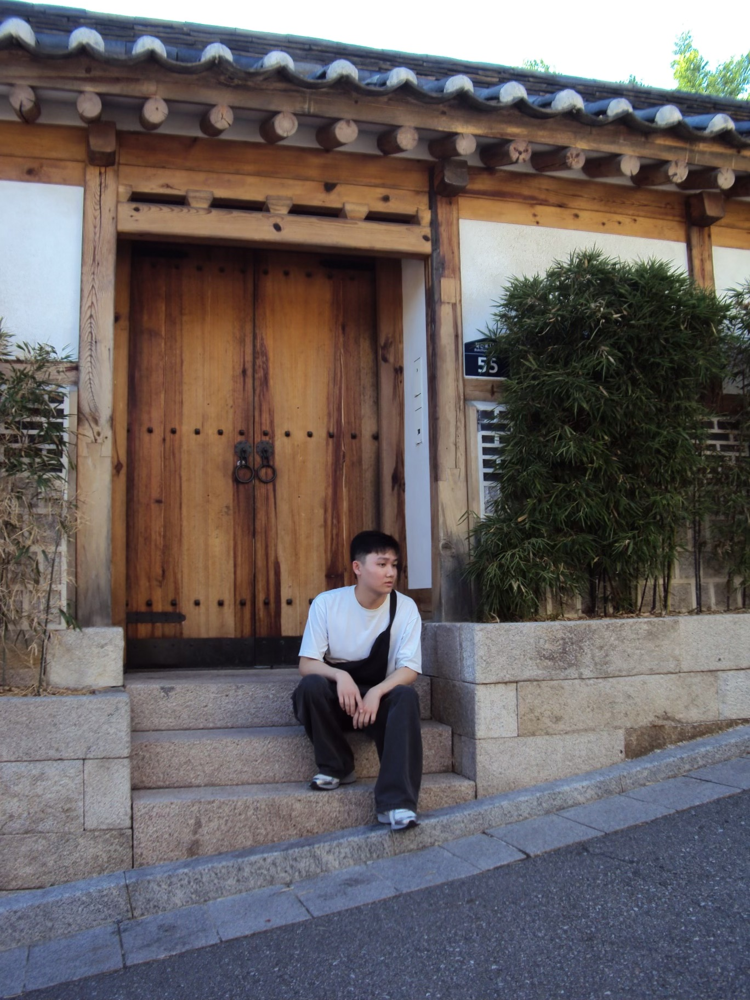

# Hi, I'm Yangyang! <!-- omit in toc -->



## Contents <!-- omit in toc -->
- [About Me](#about-me)
- [Interests](#interests)
- [?](#meow)

### About Me
I am third year undergraduate student majoring in **Mathematics - Computer Science** and minoring in **Data Science** at UC San Diego. Here's a little fun fact about me: I'm a leap day baby (born on February 29th), so I'm technically only 5 years old! I also like to dabble in a bit of frontend development (ig some backend if i feel like it).

These are my top 3 programming languages, in descending order:

1. [Python](README.md)
2. Java
3. C++

### Interests
Here are some of things I enjoy:
- [cats](https://en.wikipedia.org/wiki/Cat)
- traveling (here's a picture I took in [korea](photos/travel.jpeg))
- cats
- cats
- cats
- playing video games
- kpop
- wait, did i say cats already?

Here's a quote I take inspiration from everyday:
> "To err is human, to purr is feline" - Robert Byrne

External Link

###### meow
wait,,, in case i havent told you
```python
import random

def summon_the_felines():
    print(''.join([chr(99), chr(97), chr(116), chr(115)]))

if random.choice([True, False]):
    summon_the_felines()
else:
    summon_the_felines()
```
\
cats owned:
- [ ] 1
- [ ] 2
- [ ] 3
- [ ] 4
- [x] i dont have one :(


